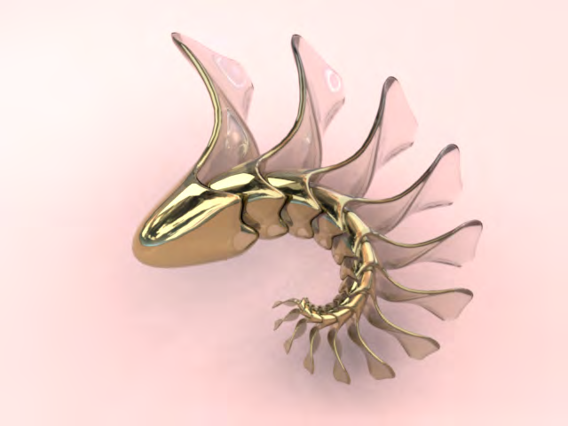
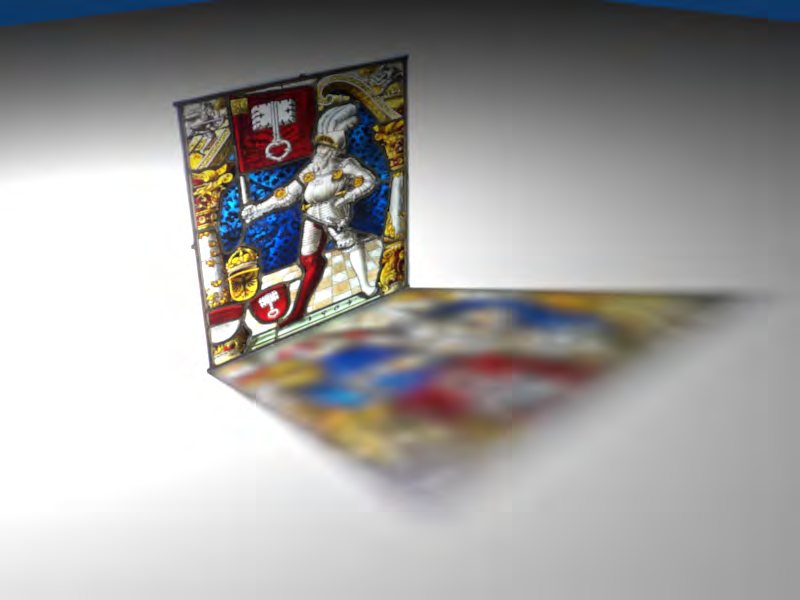
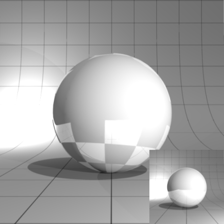

# Shaders/Janino Mix

## From Sunflow Wiki

## < Shaders

## Author: Don Casteel based on Mark Thorpe&#39;s version of the shader.

```text
shader {
name "mix.shader"
type janino
```

<code>

import org.sunflow.core.ShadingState;

import org.sunflow.image.Color;

import org.sunflow.core.ParameterList;

import org.sunflow.SunflowAPI;

import org.sunflow.math.Point3;

import org.sunflow.core.shader.*;

DiffuseShader ds = new DiffuseShader();

GlassShader gs = new GlassShader();

MirrorShader ms = new MirrorShader();

boolean b1, b2, b3, initflag, updflag = false;

Color color = new Color(0f,0f,0f);



```text
public Color getRadiance(ShadingState state) {
```

Color rColor = new Color(0f,0f,0f);

float gap = 1f; // % size of the blending region

float offset = -0.25f; // % offset from object centre of the blend position

float extenty = state.getInstance().getBounds().getExtents().y;

float centery = state.getInstance().getBounds().getCenter().y;

centery += offset * extenty;

float bot = centery - extenty * gap/2f; // start gap

float top = centery + extenty * gap/2f; // end gap

float fac = top - bot;

float hit = state.getPoint().y;

if (hit < bot)

```text
{ // below the gap
```

rColor.set(gs.getRadiance(state));

return rColor;

```text
}
```

if (hit > top)

```text
{ // above the gap
```

rColor.set(ms.getRadiance(state));

return rColor;

```text
}
// in the gap
```

Point3 p = new Point3(state.getPoint()); // save point

Color m = new Color( ms.getRadiance(state) );

state.getPoint().set(p); // restore point

Color g = new Color( gs.getRadiance(state) );

```text
//rColor.set(Color.blend(m, g, 0.1f ));
```

rColor.set(Color.blend(m, g, (hit - bot) / fac ));

return rColor;

```text
}
public boolean update(ParameterList pl, SunflowAPI api) {
if (!updflag) { updflag = true; // one shot
```

api.parameter( "diffuse", new Color(0.5f,0.43f,0.2f) );

b3 = ds.update(pl, api); // update diffuse shader

api.parameter( "color", new Color(0.5f,0.43f,0.2f) );

b2 = ms.update(pl, api); // update mirror shader

api.parameter( "color", new Color(1f,1f,1f) );

api.parameter( "eta", 1.5f );

api.parameter( "absorbtion.distance", 0.5f );

api.parameter( "absorbtion.color", new Color(0.3f,0.3f,0.3f) );

b1 = gs.update(pl, api); // update glass shader

return (b1 && b2 && b3);

```text
}
```

return true;

```text
}
```

</code>

```text
}
```

# Shaders/Janino Fresnel

## From Sunflow Wiki

## < Shaders

## Author: MrFoo

```text
shader {
name "fresnel"
type janino
```

<code>

import org.sunflow.core.ShadingState;

import org.sunflow.image.Color;

import org.sunflow.core.ParameterList;

import org.sunflow.SunflowAPI;

import org.sunflow.core.shader.*;

DiffuseShader light=new DiffuseShader();

DiffuseShader dark=new DiffuseShader();

```text
public Color getRadiance(ShadingState state) {
```

state.faceforward();

float c=state.getCosND();

Color l = new Color( light.getRadiance(state) );

Color d = new Color( dark.getRadiance(state) );

return Color.blend(l, d, c);

```text
}
public void scatterPhoton(ShadingState state, Color power) {
```

light.scatterPhoton(state, power); //do we need to do this?

```text
}
public boolean update(ParameterList pl, SunflowAPI api) {
```

pl.addColor( "diffuse", new Color(1.0f,0.0f,0.0f) );

boolean b2 = dark.update(pl, api);

pl.addColor( "diffuse", new Color(0.0f,1.0f,0.0f) );

boolean b1 = light.update(pl, api);

return (b1 && b2);

```text
}
```

</code>

```text
}
```

# Shaders/Janino Stained Glass

## From Sunflow Wiki

## < Shaders

## Author: Mark Thorpe

```text
shader {
name "stained_glass"
type janino
```

<code>

```text
/* Free to use for any purpose. Just do my PR a favour and leave this message here :-) */
/* usage: Insert the stained glass texture in the update() method block. MPT 13/04/07. */
```

import org.sunflow.core.ShadingState;

import org.sunflow.image.Color;

import org.sunflow.core.ParameterList;

import org.sunflow.SunflowAPI;

import org.sunflow.core.shader.*;

GlassShader s_1 = new GlassShader();

TexturedDiffuseShader s_2 = new TexturedDiffuseShader();

boolean b1, b2, b3 = false;

SunflowAPI myapi = new SunflowAPI();



```text
public Color getDiffuse( ShadingState state ) {
```

return s_2.getDiffuse( state );

```text
}
public Color getRadiance( ShadingState state ) {
```

ParameterList mypl = new ParameterList();

mypl.addColor( "color", s_2.getDiffuse( state ) );

b3 = s_1.update( mypl, myapi );

return s_1.getRadiance( state );

```text
}
public void scatterPhoton( ShadingState state, Color power ) {
```

ParameterList mypl = new ParameterList();

mypl.addColor( "color", s_2.getDiffuse( state ).mul(3f) );

b3 = s_1.update( mypl, myapi );

s_1.scatterPhoton( state, power );

```text
}
public boolean update( ParameterList pl, SunflowAPI api ) {
```

pl.addString( "texture", "./textures/sg2.jpg" );

b2 = s_2.update( pl, api );

pl.addFloat( "eta", 1.000000001f );

b1 = s_1.update( pl, api );

return ( b1 && b2 );

```text
}
```

</code>

```text
}
```

# Shaders/Janino Shiny Reflection Maps

## From Sunflow Wiki

## < Shaders

## Author: Eugene Reilly

```text
shader {
name "shinyReflectionMap"
type janino
```

<code>

import org.sunflow.SunflowAPI;

import org.sunflow.core.ParameterList;

import org.sunflow.core.Ray;

import org.sunflow.core.ShadingState;

import org.sunflow.core.Texture;

import org.sunflow.core.TextureCache;

import org.sunflow.image.Color;

import org.sunflow.math.Vector3;

Color diff;

```text
//Texture texd;
```

Texture texr;

```text
public boolean update(ParameterList pl, SunflowAPI api) {
//***Objects must have UVs mapped***
```



```text
//texd = TextureCache.getTexture("C:\\myPath\\diffuseMap.jpg", true);
//Refelction map must be grayscale
```

texr = TextureCache.getTexture("C:\\myPath\\reflectionMap.png", true);

```text
diff = new Color(1.0f,1.0f,1.0f);
```

return true;

```text
}
public Color getDiffuse(ShadingState state) {
```

return diff;

```text
//return texd.getPixel(state.getUV().x, state.getUV().y);
}
public Color getRadiance(ShadingState state) {
```

Color rColor = texr.getPixel(state.getUV().x, state.getUV().y);

float refl = rColor.getAverage();

```text
// make sure we are on the right side of the material
```

state.faceforward();

```text
// direct lighting
```

state.initLightSamples();

state.initCausticSamples();

Color d = getDiffuse(state);

Color lr = state.diffuse(d);

if (!state.includeSpecular())

return lr;

float cos = state.getCosND();

float dn = 2 * cos;

Vector3 refDir = new Vector3();

refDir.x = (dn * state.getNormal().x) + state.getRay().getDirection().x;

refDir.y = (dn * state.getNormal().y) + state.getRay().getDirection().y;

refDir.z = (dn * state.getNormal().z) + state.getRay().getDirection().z;

Ray refRay = new Ray(state.getPoint(), refDir);

```text
// compute Fresnel term
```

cos = 1 - cos;

float cos2 = cos * cos;

float cos5 = cos2 * cos2 * cos;

Color w = Color.white();

Color ret = w.copy().mul(refl);

Color r = d.copy().mul(refl);

ret.sub(r);

ret.mul(cos5);

ret.add(r);

return lr.add(ret.mul(state.traceReflection(refRay, 0)));

```text
}
```

</code>

```text
}
```

# Shaders/Janino Simple SSS

## From Sunflow Wiki

## < Shaders

## Author: Don Casteel

```text
shader {
name "simple_sss"
type janino
```

<code>

import org.sunflow.SunflowAPI;

import org.sunflow.core.ParameterList;

import org.sunflow.core.Ray;

import org.sunflow.core.Shader;

import org.sunflow.core.ShadingState;

import org.sunflow.image.Color;

import org.sunflow.math.OrthoNormalBasis;

import org.sunflow.math.Vector3;

import org.sunflow.math.Point3;

Color diff = new Color(0.3f,1.0f,0.6f);

Color spec = new Color(1.0f,1.0f,1.0f);

Color bright = new Color(1f,1f,1f);

Color dark = new Color(0f,0f,0f);

Color color = new Color(0.6f,0.8f,0.8f);

Color absorbtionColor = new Color(0.6f,0.5f,0.3f).opposite();

int numRays = 5;

float power = 100;

float reflectiveness = 0.8f;

float hardness = 0.15f;

float depth = 0.15f;

float spread = 1f;

float glossyness = 0.8f;

float absorbtionValue = 0.5f;

```text
public boolean update(ParameterList pl, SunflowAPI api) {
```

return true;

```text
}
protected Color getDiffuse(ShadingState state) {
```

return diff;

```text
}
public Color getRadiance(ShadingState state) {
```

state.faceforward();

state.initLightSamples();

state.initCausticSamples();

```text
// execute shader
```

float cos = state.getCosND();

float dn = 2 * cos;

Vector3 refDir = new Vector3();

refDir.x = (dn * state.getNormal().x) + state.getRay().getDirection().x;

refDir.y = (dn * state.getNormal().y) + state.getRay().getDirection().y;

refDir.z = (dn * state.getNormal().z) + state.getRay().getDirection().z;

Ray refRay = new Ray(state.getPoint(), refDir);

Color reflections = Color.WHITE;

Color highlights = Color.WHITE;

reflections = state.traceReflection(refRay, 0);

highlights = state.diffuse(getDiffuse(state)).add(state.specularPhong(spec, power, numRays));

reflections = Color.blend(highlights,reflections,reflectiveness);

Color sColor = state.diffuse(getDiffuse(state));

sColor = Color.blend(sColor,reflections,glossyness);

Vector3 norm = state.getNormal();

Point3 pt = state.getPoint();

pt.x += norm.x*spread;

pt.y += norm.y*spread;

pt.z += norm.z*spread;

state.getPoint().set(pt);

Color tColor = state.getIrradiance(sColor);

pt.x -= norm.x*(spread+depth);

pt.y -= norm.y*(spread+depth);

pt.z -= norm.z*(spread+depth);

state.getPoint().set(pt);

state.getNormal().set(state.getRay().getDirection());

Color sssColor = Color.add(diff,tColor.mul(state.occlusion(16,absorbtionValue, bright, dark).opposite().mul(absorbtionColor)));

sssColor.mul(absorbtionColor);

return Color.blend(sssColor,sColor,hardness);

```text
}
public void scatterPhoton(ShadingState state, Color power) {
//just a copy of the scatter method in PhongShader.......
// make sure we are on the right side of the material
```

state.faceforward();

Color d = getDiffuse(state);

state.storePhoton(state.getRay().getDirection(), power, d);

float avgD = d.getAverage();

float avgS = spec.getAverage();

double rnd = state.getRandom(0, 0, 1);

```text
if (rnd < avgD) {
// photon is scattered diffusely
```

power.mul(d).mul(1.0f / avgD);

OrthoNormalBasis onb = state.getBasis();

double u = 2 * Math.PI * rnd / avgD;

double v = state.getRandom(0, 1, 1);

float s = (float) Math.sqrt(v);

float s1 = (float) Math.sqrt(1.0f - v);

Vector3 w = new Vector3((float) Math.cos(u) * s, (float) Math.sin(u) * s, s1);

w = onb.transform(w, new Vector3());

state.traceDiffusePhoton(new Ray(state.getPoint(), w), power);

```text
}
else if (rnd < avgD + avgS) {
// photon is scattered specularly
```

float dn = 2.0f * state.getCosND();

```text
// reflected direction
```

Vector3 refDir = new Vector3();

refDir.x = (dn * state.getNormal().x) + state.getRay().dx;

refDir.y = (dn * state.getNormal().y) + state.getRay().dy;

refDir.z = (dn * state.getNormal().z) + state.getRay().dz;

power.mul(spec).mul(1.0f / avgS);

OrthoNormalBasis onb = state.getBasis();

double u = 2 * Math.PI * (rnd - avgD) / avgS;

double v = state.getRandom(0, 1, 1);

float s = (float) Math.pow(v, 1 / (this.power + 1));

float s1 = (float) Math.sqrt(1 - s * s);

Vector3 w = new Vector3((float) Math.cos(u) * s1, (float) Math.sin(u) * s1, s);

w = onb.transform(w, new Vector3());

state.traceReflectionPhoton(new Ray(state.getPoint(), w), power);

```text
}
}
public void init(ShadingState state) {
}
```

</code>

```text
}
```


# Shaders/Janino Specular Pass

## From Sunflow Wiki

## < Shaders

## Author: Eugene Reilly

```text
shader {
name specPass
type janino
```

<code>

import org.sunflow.SunflowAPI;

import org.sunflow.core.ParameterList;

import org.sunflow.core.ShadingState;

import org.sunflow.image.Color;

private Color spec = Color.WHITE;

private float power = 20;

private int numRays = 4;

```text
public Color getRadiance(ShadingState state) {
// make sure we are on the right side of the material
```

state.faceforward();

```text
// setup lighting
```

state.initLightSamples();

state.initCausticSamples();

```text
// execute shader
```

return state.specularPhong(spec, power, numRays);

```text
}
public boolean update(ParameterList pl, SunflowAPI api) {
spec = pl.getColor("specular", spec);
```

numRays = pl.getInt("samples", numRays);

return true;

```text
}
```

</code>

```text
}
```

# Shaders/Janino Translucent

From Sunflow Wiki

< Shaders

Author: Mark Thorpe

For good results, use 128 rays per sample and aa 0 1. For mind-blowing results use 256 rps and aa 0 4. For

testing use 16 rps and aa 0 0. These are all set in the sc file.

DON&#39;T use less than 2 rps, as this produces inexplicable garbage results.

Also, the use of the &#39;glob&#39; global might screw things up if running as more than a single thread. I couldn&#39;t find

a way around this unfortunately.

The shader produces the effect of translucency. It doesn&#39;t yet have the capability to include textures.


```text
/* TRANSLUCENT - WITH STORAGE AND REFLECTION OF PHOTONS */
shader {
name "translucent_sr"
type janino
```

<code>

import org.sunflow.SunflowAPI;

import org.sunflow.core.ParameterList;

import org.sunflow.core.Ray;

import org.sunflow.core.Shader;

import org.sunflow.core.ShadingState;

import org.sunflow.image.Color;

import org.sunflow.math.Vector3;

import org.sunflow.math.Point3;

import org.sunflow.math.OrthoNormalBasis;

```text
// object color
```

public Color color = Color.WHITE;

```text
// object absorption color
//public Color absorptionColor = Color.RED;
```

public Color absorptionColor = Color.BLUE;

```text
// inverse of absorption color
```

public Color transmittanceColor = absorptionColor.copy().opposite();

```text
// global color-saving variable
/* FIXME!?? - globals are not good */
```

public Color glob = Color.black();

```text
// phong specular color
```

public Color pcolor = Color.BLACK;

```text
// object absorption distance
```

public float absorptionDistance = 0.25f;

```text
// depth correction parameter
```

public float thickness = 0.002f;

```text
// phong specular power
```

public float ppower = 85f;

```text
// phong specular samples
```

public int psamples = 1;

```text
// phong flag
```

public boolean phong = false;

```text
public boolean update(ParameterList pl, SunflowAPI api) {
color = pl.getColor("color", color);
if (absorptionDistance == 0f) {
```

absorptionDistance+= 0.0000001f;

```text
}
if (!pcolor.isBlack()) {
```

phong = true;

```text
}
```

return true;

```text
}
public Color getRadiance(ShadingState state) {
```

Color ret = Color.black();

Color absorbtion = Color.white();

glob.set(Color.black());

state.faceforward();

state.initLightSamples();

state.initCausticSamples();

```text
if (state.getRefractionDepth() == 0) {
```

ret.set(state.diffuse(color).mul(0.5f));

bury(state,thickness);

```text
} else {
```

absorbtion = Color.mul(-state.getRay().getMax() / absorptionDistance, transmittanceColor).exp();

```text
}
```

state.traceRefraction(new Ray(state.getPoint(), randomVector()), 0);

glob.add(state.diffuse(color));

glob.mul(absorbtion);

```text
if (state.getRefractionDepth() == 0 && phong) {
```

bury(state,-thickness);

glob.add(state.specularPhong(pcolor,ppower,psamples));

```text
}
```

return glob;

```text
}
public void bury(ShadingState state, float th) {
```

Point3 pt = state.getPoint();

Vector3 norm = state.getNormal();

pt.x = pt.x - norm.x * th;

pt.y = pt.y - norm.y * th;

pt.z = pt.z - norm.z * th;

```text
}
public Vector3 randomVector() {
```

return new Vector3(

(float)(2f*Math.random()-1f),

(float)(2f*Math.random()-1f),

(float)(2f*Math.random()-1f)

).normalize();

```text
}
public Color getDiffuse(ShadingState state) {
```

return color;

```text
}
public void scatterPhoton(ShadingState state, Color power) {
```

Color diffuse = getDiffuse(state);

state.storePhoton(state.getRay().getDirection(), power, diffuse);

state.traceReflectionPhoton(new Ray(state.getPoint(), randomVector()), power.mul(diffuse));

```text
}
```

</code>

```text
}
```


# Shaders/Janino Wire

## From Sunflow Wiki

## < Shaders

## Author: Chris Kulla

```text
shader {
name triangle_wire
type janino
```

<code>

import org.sunflow.core.RenderState;

import org.sunflow.image.Color;

import org.sunflow.math.Vector3;

private Color lineColor = new Color(0.05f, 0.05f, 0.05f);

private Color fillColor = new Color(0.95f, 0.95f, 0.95f);

private float width = 0.02f;

```text
public Color getRadiance(RenderState state) {
```

float cos = 1 - (float) Math.pow(1 - Math.abs(Vector3.dot(state.getNormal(), state.getRay().getDirection())), 5);

float u = state.getU();

float v = state.getV();

float w = 1 - u - v;

return ((u < width || v < width || w < width) ? lineColor : fillColor).copy().mul(cos);

```text
}
public void scatterPhoton(RenderState state, Color power) {
}
```

</code>

```text
}
```

override triangle_wire true


