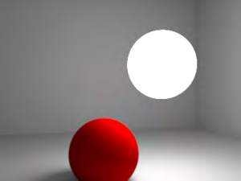
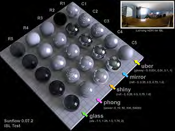
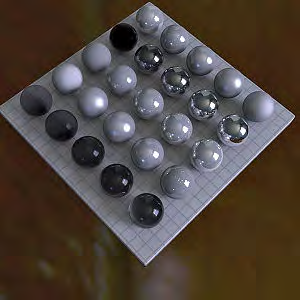

# Lights

From Sunflow Wiki

## Contents

1 Lights

1.1 Samples

2 Attenuated Lights

2.1 Point Light

2.2 Meshlight/Area Light

3 Non-Attenuated Lights

3.1 Spherical Lights

3.2 Directional Lights

4 Inifinitely Far Away Lights

4.1 Image Based Light

4.2 Sunsky

5 Showboating Lights

5.1 Cornell Box (0.07.3 Only)

## Lights

Keep in mind that for colors the syntax sRGB nonlinear is used in these examples. These values are the color space

most of us are used to. If you prefer, you can use other color spaces which I outline in the shader overview.

It&#39;s also important to note that at this time IBL and Sunsky do not emit photons, therefore, no caustics are

viewable when using these lights. All other lights can emit photons.

### Samples

Samples, samples, samples. Samples are key for the lights that use them. If they are too low, your image will look

bad. If they are too high, you&#39;re render will take forever. So it&#39;s important to experiment to get the right setting for

your scene. I suggest starting with low samples, and working your way up till you reach just the right amount.

## Attenuated Lights

The point and area lights are attenuated, meaning that the farther away you go away from the light, the less

power/influence on the scene it has. Also remember that you can use the power/radiance in negative numbers to

remove light from the scene.

### Point Light

```text
light {
type point
color { "sRGB nonlinear" 1.000 1.000 1.000 }
power 100.0
p 1.0 3.0 6.0
}
```

For the point light, power is measured in watts.

### Meshlight/Area Light

```text
light {
type meshlight
name meshLamp
emit { "sRGB nonlinear" 1.000 1.000 1.000 }
radiance 100.0
samples 16
points 4
```

0.6 0.1 6.0

0.3 1.0 6.0

1.0 1.0 5.5

1.0 0.3 5.5

```text
triangles 2
```

0 1 2

0 2 3

```text
}
```

Any mesh can become a light. For mesh lights you specify the radiance (which is watts/sr/m^2), and the total power

is radiance*area*pi (in watts if your area was m^2). The example above is a simple square. Area lights/mesh lgihts

automatically create soft shadows and you control the quality of shadows by changing the samples value. An

important thing to keep in mind is that the light samples are per face (per triangle), so the more complicated the

mesh the more it will take to render. For this reason a simple two triangle quad is probably the way to go. See this

thread (http://sunflow.sourceforge.net/phpbb2/viewtopic.php?t=128) for more information.

For large area lights, it&#39;s much better to let them be sampled by the indirect rays (diffuse and glossy) than to try and

use the light sampling to get a good result. In these cases in 0.07.2, you can set the meshlight samples to 0 (so they

won&#39;t be counted by direct lighting). The 0.07.3 SVN version of Sunflow will not count the lights at all if you do

this. But with a simple change to the SVN source you can get the lights to be counted by the indirect rays. Change

the getRadiance method in the area light to this and compile a new Sunflow:

```text
public Color getRadiance(ShadingState state) {
```

if (numSamples > 0 && !state.includeLights())

return Color.BLACK;

state.faceforward();

```text
// emit constant radiance
```

return state.isBehind() ? Color.BLACK : radiance;

```text
}
```

## Non-Attenuated Lights

### Spherical Lights

```text
light {
type spherical
color { "sRGB nonlinear" 1.000 1.000 1.000 }
radiance 100.0
center 5 -1.5 6
radius 30
samples 16
}
```

## The appearance of sphere lights is greatly influenced by the anti-aliasing filter you use. See the Image Settings page

## for examples.

### Example of a spherical light, using 16 samples,

### radius=1

## Directional Lights

```text
light {
type directional
source 4 1 6
target 3.5 0.8 5
radius 23
emit { "sRGB nonlinear" 1.000 1.000 1.000 }
intensity 100
}
```

# Inifinitely Far Away Lights

## For IBL/Sunsky power, the exact power is measured from the content of the map or the sun position. For IBL it

## will also depend on a correctly calibrated image.

## Image Based Light

```text
light {
type ibl
```

image "C:\mypath\myimage.hdr"

```text
center 0 -1 0
```



```text
up 0 0 1
lock true
samples 200
}
```

The image based light is designed for use with high dynamic range images. The "center" vector is a world space

direction that points towards the center pixel in the map, letting you rotate the map however you want. The "up"

orients the map relative to that axis. This is to be able to support multiple 3d applications: some like to have Y

pointing up, others Z.

An important feature of this light is that we can turn importance sampling on or off. Using lock false (importance

sampling) forces use of unique samples per shading point instead of fixing them over the whole image. Which

basically means that when lock false is set, the points of the image that will affect the light result the most (i.e. more

“important”) will be sampled more.

Importance sampling turned off (lock true) for a

variety of shaders with various settings.

Importance sampling turned on (lock false).

You can find the files that were used to create the above image here (.zip)

(http://www.geneome.net/other/otherfiles/IBLTest.zip) .

So a conclusion one could draw from these tests is that when using the phong and uber shaders with high power

and glossy values respectively, using importance sampling can reduce the light points from the ibl. Increasing

```text
samples does not rid the phong and uber shaders of, what Kirk referred to as, “constellations.”
```

You don&#39;t have explicit control over the handedness of the rotation. If it looks like your image is coming in flipped,

just do that in your favorite hdr image editor.

Sunflow only supports lon/lat HDR maps at the moment. So if you have your images in another format (spherical

probe or cube-map) you&#39;ll need to do some kind of conversion in another program (like HDRShop).

### Sunsky





```text
light {
type sunsky
up 0 0 1
east 0 1 0
sundir 0.5 0.2 0.8
turbidity 6.0
samples 128
}
```

There isn&#39;t a setting in the syntax that controls sun intensity, but you can instead control the suns direction in terms of

angle to the object. So if the Sunsky direction is at a near 0 degree angle with the object (the sun on the horizon) it

will be dark and the sky will be more a sunset color. If the direction is more high in the sky at around 80 degrees it

will be bright with the sky being white/blue. Changing the up and east values can also change the look, but these are

more used to change how the Sunsky is interpreted in different world spaces which might be required in different

applications. The up and east values in the above example usually work for everyone.

The Sunsky light has a set horizon where the sky stops and the blackness of the world shows up. Normally an

infinite plane is the work-around. Future versions of Sunflow might have a control to extend the sky, but you can

also modify the source and compile Sunflow yourself so the sky extends on its own. In

src.org.sunflow.core.light.SunSkyLight.java go to the line that says

groundExtendSky = false;

Change it to

groundExtendSky = true;

Compile Sunflow and the sky will no longer terminate at the horizon.

## Showboating Lights

The Cornell Box isn&#39;t really a light that you would use in a typical scene but it is useful to illuminate your models.

Plus, in the SVN source&#39;s plugin registry it&#39;s listed under lights now so there you have it, it must be a light ;). The

code block specifies that it&#39;s an object in 0.07.2 (as the example show below) but in 0.07.3 and up it will be a light

```text
so you would use "ightl {" rather than "object {".
```

### Cornell Box (0.07.3 Only)

In 0.07.3 and up, the cornell box is a light. Prior to this, it was considered a primitive.

```text
light {
type cornellbox
```

corner0 -60 -60 0

corner1 60 60 100

```text
left 0.80 0.25 0.25
right 0.25 0.25 0.80
top 0.70 0.70 0.70
bottom 0.70 0.70 0.70
back 0.70 0.70 0.70
emit 15 15 15
samples 32
}
```

Let&#39;s do a quick run through. The size of the box is defined by corner0 and corner1. Corner0&#39;s x y z values

corresponds to position of the lower left corner of the box closest to us. Corner1 is the back top right corner. In the

example above, the center of the world (0,0) is in the center of the floor. The color of the sides of the box are then

defined. The emit and samples values are just like the meshlight (above).