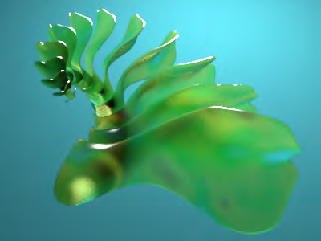

# Procedurally Textured SSS

From Sunflow Wiki

Author: Don Casteel

The first procedural texture for Sunflow, this project was created by Don to work in conjunction with his true SSS

shader.

## Contents

1 Docs

2 .sc Syntax

2.1 Solid Texture

2.2 Volume Texture

3 Diff

## Docs

Don has written up some documentation for the shader which you can find here (.doc)

(https://fractrace.dev.java.net/files/documents/6137/91100/SSS_Solid_Shader_documentation.doc) .

## .sc Syntax



Obviously it&#39;s slower, but only as you raise the sample level. Each sub-ray samples the texture by the number of

samples, so the sampling is exponential... 4 rays samples 4 times =16 texture samples, 5 rays 5 times = 25 samples

etc.... PLUS n-samples along the reverse normal to the thickness, so actually if samples=5 there will be 30 texture

samples.

You can use either "fill" and "veins" OR "map" but there is no syntax check, so if something is wrong, it will

probably crash Sunflow. The value after "map" is the number of color values you are using. Each color line has a

value for red, green, and blue, plus a value between 0.0 and 1.0 as it&#39;s location in the map.

Some notes from Don:

There are still a few problems with this current version of the shader, particularly with "diffusion" values

above 0.5 there starts to be visible banding that I just can&#39;t figure out.

"diffusion" is a value >0 and <1 that controls how much the random rays diverge from the regular refraction

vector. Values near zero will look a lot like a "Glass" shader, and values near 1.0 should have more of a

typical subsurface scattering look.

The "maxOpacity" parameter cuts off the calculation once the opacity exceeds the parameter value. The

purpose is mainly to shorten render times in preliminary scene tests.

"sampDist" is again to help with render times, I was using the thickness value to increment through the

volume, but very shallow thicknesses with low opacities were taking forever, so you can set this parameter

higher than the thickness value to reduce the samples along each scattering ray.

specular is ignored if the power is set to zero.

absorptionPower now is an opacity value per the thickness distance

```text
opacity is cumulitive and nonlinear
```

for now to get the volumetric shader you MUST use "volume_texture" with a colormap as shown below

```text
for a solid color use a colormap where all colors are the same
```

the "environment" parameter is used to control how much the exit rays contribute to the final hit color

### Solid Texture

The solid texture shader is the normal sss shader and can use map files as the volume shader can below.

```text
shader {
name "sssShdr2"
type sss
```

solid_texture

```text
map 2
```

0 1 1 0.0

1 1 1 1.0

```text
function 0
size 10
scale 3.142
opacity 0.0625
thickness 0.0125
```

sssRays 5

```text
specular 0.2 0.2 0.2 80
```

phongRays 5

maxOpacity 0.3

```text
diffusion 0.125
```

sampDist 0.0625

```text
environment 0.75
}
```

## Volume Texture

## Although the quality is much better and more accurate, the volume shader is slower, so be very careful how high

## you set the "sssRays" parameter. I suggest starting with values of 3-5 until you get a feel for it. You also have to

## have the trace-depths for "diff" and "refr" set to a minimum of 2, but setting them any higher will slow things down a

## lot. Here&#39;s the syntax for using a Fractint pallet map:

```text
shader {
name "sssShader01"
type sss
```

volume_texture

mapfile "C:\Documents and Settings\Don\My Documents\Apophysis\Apophysis-080318-201.map"

```text
function 0
size 0.25
scale 3.142
opacity 0.12
thickness 0.12
```

sssRays 12

```text
specular 0.2 0.2 0.2 0
```

phongRays 3

maxOpacity 0.999

```text
diffusion 0.999
```

sampDist 0.12

```text
environment 0.75
```

maxSubRayLength 2.5

sssTraceDepth 1

```text
}
```

## Here&#39;s the syntax for using your own map:

```text
shader {
name "sssShader01"
type sss
```

volume_texture

```text
map 7
```

1.0 1.0 1.0 0.0

1.0 1.0 1.0 0.35

0.6 0.0 0.0 0.425

1.0 1.0 1.0 0.5

0.75 0.7 0.0 0.575

1.0 0.0 0.5 0.65

1.0 1.0 1.0 1.0

```text
function 0
size 0.25
scale 3.142
opacity 0.12
thickness 0.12
```

sssRays 12

```text
specular 0.2 0.2 0.2 0
```

phongRays 3

maxOpacity 0.999

```text
diffusion 0.999
```

sampDist 0.12

```text
environment 0.75
```

maxSubRayLength 2.5

sssTraceDepth 1

```text
}
```

## Diff

You can find the diff for this here (.diff)

(https://fractrace.dev.java.net/files/documents/6137/91229/sss_Solid_Shader_Mar24-08.diff) . The big ticket item

for this code is the SolidTexture.java where the procedural magic happens. It&#39;s also important to note that the diff

contains the fake ambient term modification which isn&#39;t required for the shader.