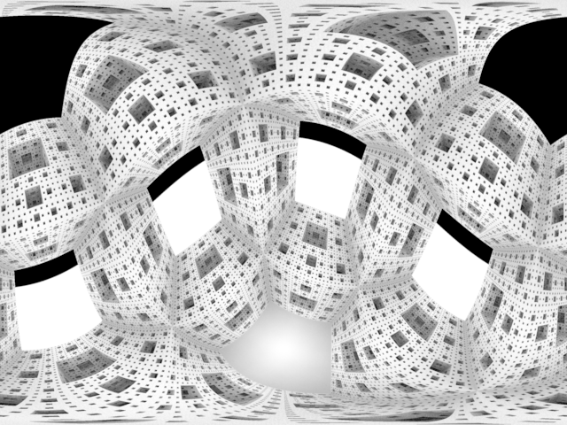
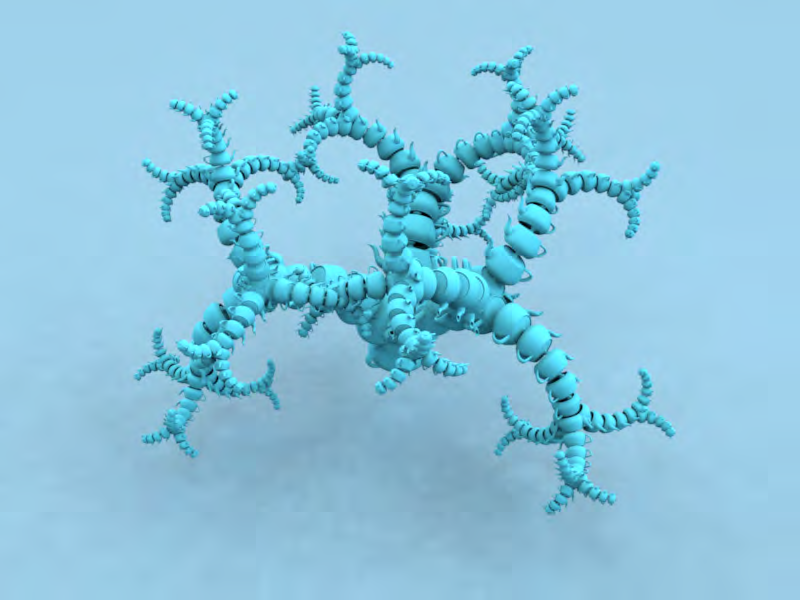
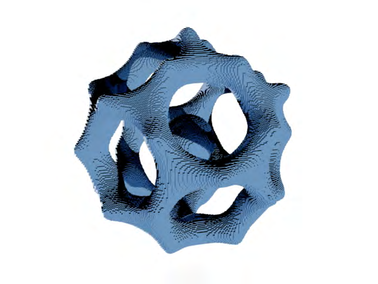
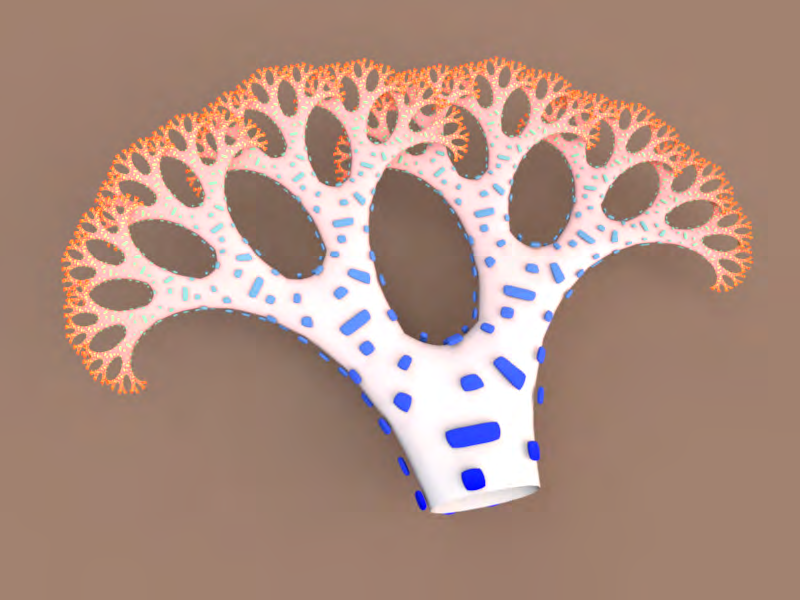

# Sunflow Projects

From Sunflow Wiki

## Introduction

Most of the projects below are meant to be added to a .java file (though some are patches to the source). So for

the java file projects all you would need to do is take a plain text file then rename it to anything.java. Using the GUI

```text
you can open this file like a scene file or use the command line to render the file out by putting the image type of
```

your choice (e.g. -o output.hdr fractal.java). Some of the files below make use of outside scene files that you must

have, but several are "stand-alone" and don&#39;t require you to do anything except load the java file.

Menger Sponge

Iterative Fractals

File Mesh Allowing UV And Normal Data

Isosurface using CubeGrid class

Quadric Primitive (http://sunflow.sourceforge.net/phpbb2/viewtopic.php?t=422)

Shader Blend Through The Iterations

Modified Fake Ambient Term

Filter Size Control

Source Code Shaders

IsoCube Primitive Using Version 0.06.3

Isometric Lens

## Note On The SVN Version

You might notice that running these files using the SVN version of Sunflow (0.07.3 and up) may throw errors. This

may be due to several changes to the code, but I will list the top two things you should check/correct:

"parse" has been replaced by "nclude"i

Calling objects is different in 0.07.3 thanks to the use of the plugin registry. As an example, lets look at how

a camera is added to the .java file. The 0.07.2 way is to use the following:

camera("myCamera", new PinholeLens());

The 0.07.3 way is a bit different.

camera("myCamera", "pinhole");

# Menger Sponge

## From Sunflow Wiki

## Author: Chris Kulla

import org.sunflow.SunflowAPI;

import org.sunflow.core.*;

import org.sunflow.core.camera.*;

import org.sunflow.core.primitive.*;

import org.sunflow.core.shader.*;

import org.sunflow.image.Color;

import org.sunflow.math.*;

```text
// Change settings here
```

int depth = 5;

boolean preview = false;

```text
public void build() {
```

parameter("eye", new Point3(2.0f, 2.0f, -5.0f));

parameter("target", new Point3(0, 0, 0));

parameter("up", new Vector3(0.0f, 1.0f, 0.0f));

parameter("fov", 45.0f);

parameter("aspect", 2.0f);



camera("camera_outside", new PinholeLens());

parameter("eye", new Point3(0, 0.2f, 0));

parameter("target", new Point3(-1.0f, -0.5f, 0.5f));

parameter("up", new Vector3(0.0f, 1.0f, 0.0f));

camera("camera_inside", new SphericalLens());

parameter("maxdist", 0.4f);

parameter("samples", 16);

shader("ao_sponge", new AmbientOcclusionShader());

parameter("maxdist", 0.4f);

parameter("samples", 128);

shader("ao_ground", new AmbientOcclusionShader());

geometry("sponge", new MengerSponge(depth));

```text
// Matrix4 m = null;
// m = Matrix4.rotateX((float) Math.PI / 3);
// m = m.multiply(Matrix4.rotateZ((float) Math.PI / 3));
// parameter("transform", m);
```

parameter("shaders", "ao_sponge");

instance("sponge.instance", "sponge");

parameter("center", new Point3(0, -1.25f, 0.0f));

parameter("normal", new Vector3(0.0f, 1.0f, 0.0f));

geometry("ground", new Plane());

parameter("shaders", "ao_ground");

instance("ground.instance", "ground");

```text
// rendering options
```

parameter("camera", "camera_inside");

```text
// parameter("camera", "camera_outside");
```

parameter("resolutionX", 1024);

parameter("resolutionY", 768);

```text
if (preview) {
```

parameter("aa.min", 0);

parameter("aa.max", 1);

parameter("bucket.order", "spiral");

```text
} else {
```

parameter("aa.min", 1);

parameter("aa.max", 2);

parameter("bucket.order", "column");

parameter("filter", "mitchell");

```text
}
```

options(DEFAULT_OPTIONS);

```text
}
private static class MengerSponge extends CubeGrid {
```

private int depth;

```text
MengerSponge(int depth) {
```

this.depth = depth;

```text
}
public boolean update(ParameterList pl, SunflowAPI api) {
```

int n = 1;

for (int i = 0; i < depth; i++)

n *= 3;

pl.addInteger("resolutionX", n);

pl.addInteger("resolutionY", n);

pl.addInteger("resolutionZ", n);

return super.update(pl, api);

```text
}
protected boolean inside(int x, int y, int z) {
for (int i = 0; i < depth; i++) {
```

if ((x % 3) == 1 ? (y % 3) == 1 || (z % 3) == 1 : (y % 3) == 1 && (z % 3) == 1) return false;

x /= 3;

y /= 3;

z /= 3;

```text
}
```

return true;

```text
}
}
```


# Iterative Fractals

## From Sunflow Wiki

## Author: Don Casteel

## Instructions: Load in Sunflow as a .java file with a scene called ComboJavaSC.sc with an object in that file named "tem"i that has a

## shader called "temShader".i

import org.sunflow.core.tesselatable;

import org.sunflow.core.tesselatable.*;

import org.sunflow.SunflowAPI;

import org.sunflow.core.*;

import org.sunflow.core.camera.*;

import org.sunflow.core.primitive.*;

import org.sunflow.core.shader.*;

import org.sunflow.image.Color;

import org.sunflow.math.*;

import org.sunflow.core.LightSource;

import org.sunflow.core.light.*;

```text
// Change settings here
```

boolean preview = false;

int maxiteration = 22; // total iterations to generate (careful instances are exponential)

int branch = 5; // branch every ? iterations



```text
//define globals
```

float geometryScale = 1.3f; //scale the initial object before iterating

int f = 0;

Matrix4 m = null;

Matrix4 m000 = null;

Matrix4 m001 = null;

Matrix4 m002 = null;

public void build()

```text
{
```

parse("ComboJavaSC.sc"); // create the scene

parameter("diffuse", new Color(0.1f,0.75f,1f));

shader("ds_objects", new DiffuseShader());

m = Matrix4.scale(geometryScale);

```text
// this is the first instance at the starting point
```

parameter("transform", m);

parameter("shaders", "itemShader"); // itemShader is defined in "ComboJavaSC.sc"

instance("item.instance_"+f, "item"); // "item" is defined in "ComboJavaSC.sc"

f++;

```text
// this transform is used for every iteration even between branches
```

m000 = Matrix4.scale(geometryScale);

m000 = m000.rotate(1f,0f,0f,0.875f/4f);

m000 = m000.multiply(Matrix4.translation(0f,0f,0.88f/geometryScale));

m000 = m000.multiply(Matrix4.scale(0.90f));

```text
// branching transform
```

m001 = Matrix4.scale(1f);

m001 = m001.multiply(Matrix4.rotate(0f,0f,1f,2.094395102f));

m001 = m001.multiply(m000);

```text
// branching transform
```

m002 = Matrix4.scale(1f);

m002 = m002.multiply(Matrix4.rotate(0f,0f,1f,-2.094395102f));

m002 = m002.multiply(m000);

```text
Matrix4[] trnsfrms = {m000,m001,m002}; /* group the transforms to be passed to the iteration method */
```

iterate(Matrix4.scale(1f),0,trnsfrms,0); // call the iteration method

```text
// parameter("diffuse", new Color(0.2f,0.3f,0.1f));
// shader("ds_ground", new DiffuseShader());
}
```

public void iterate(Matrix4 matrix, int itn, Matrix4[] xforms, int fh)

```text
{
// printMatrix(matrix,"\n--> in matrix f=" + f + ": ");
// printMatrix(xforms[0],"xforms[0] f=" + f + ": ");
// printMatrix(xforms[1],"xforms[1] f=" + f + ": ");
// printMatrix(xforms[2],"xforms[2] f=" + f + ": ");
```

Matrix4 m41 = Matrix4.scale(1f);

Matrix4 m42 = Matrix4.scale(1f);

Matrix4 m43 = Matrix4.scale(1f);

if(f==1)

```text
{
```

f++;

parameter("transform", m.multiply(m41));

parameter("shaders", "itemShader");

instance("item.instance_"+f, "item");

iterate(m41,itn+1,xforms,fh+1);

f++;

m42=m41.multiply(xforms[1]);

parameter("transform", m.multiply(m42));

parameter("shaders", "itemShader");

instance("item.instance_"+f, "item");

iterate(m42,itn+1,xforms,fh+1);

f++;

m43=m41.multiply(xforms[2]);

parameter("transform", m.multiply(m43));

parameter("shaders", "itemShader");

instance("item.instance_"+f, "item");

iterate(m43,itn+1,xforms,fh+1);

```text
}
```

else

```text
{
```

m41=m41.multiply(matrix);

m42=m42.multiply(matrix);

m43=m43.multiply(matrix);

f++;

m41=m41.multiply(xforms[0]);

if(itn<=maxiteration)

```text
{
```

parameter("transform", m.multiply(m41));

parameter("shaders", "itemShader");

instance("item.instance_"+f, "item");

iterate(m41,itn+1,xforms,fh+1);

```text
};
```

if(fh==branch)

```text
{
```

f++;

m41=m41.multiply(xforms[0]);

if(itn<=maxiteration)

```text
{
```

parameter("transform", m.multiply(m41));

parameter("shaders", "itemShader");

instance("item.instance_"+f, "item");

iterate(m41,itn+1,xforms,0);

```text
};
```

f++;

m42=m42.multiply(xforms[1]);

if(itn<=maxiteration)

```text
{
```

parameter("transform", m.multiply(m42));

parameter("shaders", "itemShader");

instance("item.instance_"+f, "item");

iterate(m42,itn+1,xforms,0);

```text
};
```

f++;

m43=m43.multiply(xforms[2]);

if(itn<=maxiteration)

```text
{
```

parameter("transform", m.multiply(m43));

parameter("shaders", "itemShader");

instance("item.instance_"+f, "item");

iterate(m43,itn+1,xforms,0);

```text
};
};
};
};
```

public void printMatrix(Matrix4 matrix4, String s)

```text
{
```

float[] fa = matrix4.asRowMajor();

for(int par=0;par<16;par++)

```text
{
```

s = s + fa[par] + " ";

```text
}
```

System.out.println(s);

```text
}
/* Work In Progress
//utility class
```

class TformBranch

```text
{
```

Transforms[] tforms;

int branchFrequency=1;

void TformBranch(Transform[] tf, int bf)

```text
{
```

tforms = tf;

branchFrequency = bf;

```text
}
}
```

public void iterate2(TformBranch[] branches)

```text
{
```

int numBranches = branches.length()

```text
}
```

*/

# File Mesh Tweak

## From Sunflow Wiki

## Author: MrFoo

## "I was getting a bit annoyed with the lack of a file importer that actually accepts uv/normal data, so did a bit of a

## hack job on FileMesh.java adding some code I wrote for a different application into it. It now supports

## vertex/texture/uv info.. but now isn&#39;t happy if there&#39;s just vertex, or just vertex/uv info etc. so from one extreme to

## the other. However it may still be useful to someone. Oh, and it doesn&#39;t import the materials or anything, just the

## relevant co-ordinates for the faces/vertices loaded. So you can bake a lightmap with it, but not easily load a fully

## textured object."

## The modified FileMesh.java:

package org.sunflow.core.tesselatable;

import java.io.BufferedInputStream;

import java.io.BufferedReader;

import java.io.DataInputStream;

import java.io.File;

import java.io.FileInputStream;

import java.io.FileNotFoundException;

import java.io.FileReader;

import java.io.IOException;

import java.nio.ByteOrder;

import java.nio.FloatBuffer;

import java.nio.IntBuffer;

import java.nio.MappedByteBuffer;

import java.nio.channels.FileChannel;

import java.util.ArrayList;

import org.sunflow.SunflowAPI;

import org.sunflow.core.ParameterList;

import org.sunflow.core.PrimitiveList;

import org.sunflow.core.Tesselatable;

import org.sunflow.core.ParameterList.InterpolationType;

import org.sunflow.core.primitive.TriangleMesh;

import org.sunflow.math.BoundingBox;

import org.sunflow.math.Matrix4;

import org.sunflow.math.Point3;

import org.sunflow.math.Vector3;

import org.sunflow.system.Memory;

import org.sunflow.system.UI;

import org.sunflow.system.UI.Module;

import org.sunflow.util.FloatArray;

import org.sunflow.util.IntArray;

```text
public class FileMesh implements Tesselatable {
public class triinfo
{
```

public int vert;

public int norm;

public int uv;

triinfo(String data)

```text
{
```

vert=0; //.obj is 1-indexed not 0-indexed

norm=0;

uv=0;

String[] inf=data.split("/");

if(inf.length==1)

```text
{
```

vert=Integer.parseInt(inf[0]);

```text
}
```

if(inf.length==2 && data.indexOf("//")<0) // "vert//normal"

```text
{
```

vert=Integer.parseInt(inf[0]);

norm=Integer.parseInt(inf[1]);

```text
}
```

else // "vert/uv"

```text
{
```

vert=Integer.parseInt(inf[0]);

uv=Integer.parseInt(inf[1]);

```text
}
```

if(inf.length==3)

```text
{
```

vert=Integer.parseInt(inf[0]);

uv=Integer.parseInt(inf[1]);

norm=Integer.parseInt(inf[2]);

```text
}
```

vert-=1;//"bad" now == -1 and we are 0-index not 1-index

norm-=1;

uv-=1;

```text
}
}
```

private String filename = null;

private boolean smoothNormals = false;

```text
public BoundingBox getWorldBounds(Matrix4 o2w) {
// world bounds can&#39;t be computed without reading file
// return null so the mesh will be loaded right away
```

return null;

```text
}
public PrimitiveList tesselate() {
if (filename.endsWith(".ra3")) {
try {
```

UI.printInfo(Module.GEOM, "RA3 - Reading geometry: \"%s\" ...", filename);

File file = new File(filename);

FileInputStream stream = new FileInputStream(filename);

MappedByteBuffer map = stream.getChannel().map(FileChannel.MapMode.READ_ONLY, 0, file.length());

map.order(ByteOrder.LITTLE_ENDIAN);

IntBuffer ints = map.asIntBuffer();

FloatBuffer buffer = map.asFloatBuffer();

int numVerts = ints.get(0);

int numTris = ints.get(1);

UI.printInfo(Module.GEOM, "RA3 - * Reading %d vertices ...", numVerts);

float[] verts = new float[3 * numVerts];

for (int i = 0; i < verts.length; i++)

verts[i] = buffer.get(2 + i);

UI.printInfo(Module.GEOM, "RA3 - * Reading %d triangles ...", numTris);

int[] tris = new int[3 * numTris];

for (int i = 0; i < tris.length; i++)

tris[i] = ints.get(2 + verts.length + i);

stream.close();

UI.printInfo(Module.GEOM, "RA3 - * Creating mesh ...");

return generate(tris, verts, smoothNormals);

```text
} catch (FileNotFoundException e) {
```

e.printStackTrace();

UI.printError(Module.GEOM, "Unable to read mesh file \"%s\" - file not found", filename);

```text
} catch (IOException e) {
```

e.printStackTrace();

UI.printError(Module.GEOM, "Unable to read mesh file \"%s\" - I/O error occured", filename);

```text
}
} else if (filename.endsWith(".obj")) {
```

int lineNumber = 1;

```text
try {
```

UI.printInfo(Module.GEOM, "OBJ - Reading geometry: \"%s\" ...", filename);

FloatArray verts = new FloatArray();

FloatArray vertsnormal = new FloatArray();

FloatArray vertsuv = new FloatArray();

```text
//IntArray tris = new IntArray();
```

ArrayList tris=new ArrayList();

FileReader file = new FileReader(filename);

BufferedReader bf = new BufferedReader(file);

String line;

```text
while ((line = bf.readLine()) != null) {
if (line.startsWith("v ")) {
```

String[] v = line.split("\\s+");

verts.add(Float.parseFloat(v[1]));

verts.add(Float.parseFloat(v[2]));

verts.add(Float.parseFloat(v[3]));

```text
}
```

else if(line.startsWith("vn"))

```text
{
```

String[] vn=line.split("\\s+");

vertsnormal.add(Float.parseFloat(vn[1]));

vertsnormal.add(Float.parseFloat(vn[2]));

vertsnormal.add(Float.parseFloat(vn[3]));

```text
}
```

else if(line.startsWith("vt"))

```text
{
```

String[] vt=line.split("\\s+");

vertsuv.add(Float.parseFloat(vt[1]));

vertsuv.add(Float.parseFloat(vt[2]));

```text
}
else if (line.startsWith("f")) {
```

String[] f = line.split("\\s+");

if (f.length == 5)

```text
{
```

triinfo v1=new triinfo(f[1]);

triinfo v2=new triinfo(f[2]);

triinfo v3=new triinfo(f[3]);

triinfo v4=new triinfo(f[4]);

tris.add(v1);

tris.add(v2);

tris.add(v3);

tris.add(v1);

tris.add(v3);

tris.add(v4);

```text
} else if (f.length == 4)
{
```

triinfo v1=new triinfo(f[1]);

triinfo v2=new triinfo(f[2]);

triinfo v3=new triinfo(f[3]);

tris.add(v1);

tris.add(v2);

tris.add(v3);

```text
}
}
```

if (lineNumber % 100000 == 0)

UI.printInfo(Module.GEOM, "OBJ - * Parsed %7d lines ...", lineNumber);

lineNumber++;

```text
}
```

file.close();

UI.printInfo(Module.GEOM, "OBJ - * Creating mesh ...");

return generateMine(tris, verts.trim(), vertsuv.trim(), vertsnormal.trim(), smoothNormals);

```text
} catch (FileNotFoundException e) {
```

e.printStackTrace();

UI.printError(Module.GEOM, "Unable to read mesh file \"%s\" - file not found", filename);

```text
} catch (NumberFormatException e) {
```

e.printStackTrace();

UI.printError(Module.GEOM, "Unable to read mesh file \"%s\" - syntax error at line %d", lineNumber);

```text
} catch (IOException e) {
```

e.printStackTrace();

UI.printError(Module.GEOM, "Unable to read mesh file \"%s\" - I/O error occured", filename);

```text
}
} else if (filename.endsWith(".stl")) {
try {
```

UI.printInfo(Module.GEOM, "STL - Reading geometry: \"%s\" ...", filename);

FileInputStream file = new FileInputStream(filename);

DataInputStream stream = new DataInputStream(new BufferedInputStream(file));

file.skip(80);

int numTris = getLittleEndianInt(stream.readInt());

UI.printInfo(Module.GEOM, "STL - * Reading %d triangles ...", numTris);

long filesize = new File(filename).length();

```text
if (filesize != (84 + 50 * numTris)) {
```

UI.printWarning(Module.GEOM, "STL - Size of file mismatch (expecting %s, found %s)", Memory.bytesToString(84 + 14 * numTris), Memory.bytesToString(filesize));

return null;

```text
}
```

int[] tris = new int[3 * numTris];

float[] verts = new float[9 * numTris];

```text
for (int i = 0, i3 = 0, index = 0; i < numTris; i++, i3 += 3) {
// skip normal
```

stream.readInt();

stream.readInt();

stream.readInt();

```text
for (int j = 0; j < 3; j++, index += 3) {
```

tris[i3 + j] = i3 + j;

```text
// get xyz
```

verts[index + 0] = getLittleEndianFloat(stream.readInt());

verts[index + 1] = getLittleEndianFloat(stream.readInt());

verts[index + 2] = getLittleEndianFloat(stream.readInt());

```text
}
```

stream.readShort();

if ((i + 1) % 100000 == 0)

UI.printInfo(Module.GEOM, "STL - * Parsed %7d triangles ...", i + 1);

```text
}
```

file.close();

```text
// create geometry
```

UI.printInfo(Module.GEOM, "STL - * Creating mesh ...");

if (smoothNormals)

UI.printWarning(Module.GEOM, "STL - format does not support shared vertices - normal smoothing disabled");

return generate(tris, verts, false);

```text
} catch (FileNotFoundException e) {
```

e.printStackTrace();

UI.printError(Module.GEOM, "Unable to read mesh file \"%s\" - file not found", filename);

```text
} catch (IOException e) {
```

e.printStackTrace();

UI.printError(Module.GEOM, "Unable to read mesh file \"%s\" - I/O error occured", filename);

```text
}
} else
```

UI.printWarning(Module.GEOM, "Unable to read mesh file \"%s\" - unrecognized format", filename);

return null;

```text
}
```

private TriangleMesh generateMine(ArrayList tris, float[] verts, float[] vertsuv, float[] vertsnormal, boolean smoothNormals)

```text
{
```

ParameterList pl = new ParameterList();

UI.printInfo(Module.GEOM, "mine - a");

int numfaces=tris.size()/3;

float[] objverts=new float[numfaces*3*3];

float[] objnorm=new float[numfaces*3*3];

float[] objtex=new float[numfaces*3*2];

int[] trisarr=new int[numfaces*3];

UI.printInfo(Module.GEOM, "mine - b");

for(int i=0;i<tris.size();i++)

```text
{
```

triinfo ti=(triinfo)tris.get(i);

trisarr[i]=i;

objverts[i*3]=verts[ti.vert*3];

objverts[i*3+1]=verts[ti.vert*3+1];

objverts[i*3+2]=verts[ti.vert*3+2];

objnorm[i*3]=vertsnormal[ti.norm*3];

objnorm[i*3+1]=vertsnormal[ti.norm*3+1];

objnorm[i*3+2]=vertsnormal[ti.norm*3+2];

objtex[i*2]=vertsuv[ti.uv*2];

objtex[i*2+1]=vertsuv[ti.uv*2+1];

```text
}
```

UI.printInfo(Module.GEOM, "mine - c");

pl.addIntegerArray("triangles", trisarr);

pl.addPoints("points", InterpolationType.VERTEX, objverts);

pl.addVectors("normals", InterpolationType.VERTEX, objnorm);

pl.addTexCoords("uvs", InterpolationType.VERTEX, objtex);

UI.printInfo(Module.GEOM, "mine - d");

TriangleMesh m = new TriangleMesh();

if (m.update(pl, null))

return m;

UI.printInfo(Module.GEOM, "mine - e");

return null;

```text
}
private TriangleMesh generate(int[] tris, float[] verts, boolean smoothNormals) {
```

ParameterList pl = new ParameterList();

pl.addIntegerArray("triangles", tris);

pl.addPoints("points", InterpolationType.VERTEX, verts);

```text
if (smoothNormals) {
```

float[] normals = new float[verts.length]; // filled with 0&#39;s

Point3 p0 = new Point3();

Point3 p1 = new Point3();

Point3 p2 = new Point3();

Vector3 n = new Vector3();

```text
for (int i3 = 0; i3 < tris.length; i3 += 3) {
```

int v0 = tris[i3 + 0];

int v1 = tris[i3 + 1];

int v2 = tris[i3 + 2];

p0.set(verts[3 * v0 + 0], verts[3 * v0 + 1], verts[3 * v0 + 2]);

p1.set(verts[3 * v1 + 0], verts[3 * v1 + 1], verts[3 * v1 + 2]);

p2.set(verts[3 * v2 + 0], verts[3 * v2 + 1], verts[3 * v2 + 2]);

Point3.normal(p0, p1, p2, n); // compute normal

```text
// add face normal to each vertex
// note that these are not normalized so this in fact weights
// each normal by the area of the triangle
```

normals[3 * v0 + 0] += n.x;

normals[3 * v0 + 1] += n.y;

normals[3 * v0 + 2] += n.z;

normals[3 * v1 + 0] += n.x;

normals[3 * v1 + 1] += n.y;

normals[3 * v1 + 2] += n.z;

normals[3 * v2 + 0] += n.x;

normals[3 * v2 + 1] += n.y;

normals[3 * v2 + 2] += n.z;

```text
}
// normalize all the vectors
for (int i3 = 0; i3 < normals.length; i3 += 3) {
```

n.set(normals[i3 + 0], normals[i3 + 1], normals[i3 + 2]);

n.normalize();

normals[i3 + 0] = n.x;

normals[i3 + 1] = n.y;

normals[i3 + 2] = n.z;

```text
}
```

pl.addVectors("normals", InterpolationType.VERTEX, normals);

```text
}
```

TriangleMesh m = new TriangleMesh();

if (m.update(pl, null))

return m;

```text
// something failed in creating the mesh, the error message will be
// printed by the mesh itself - no need to repeat it here
```

return null;

```text
}
public boolean update(ParameterList pl, SunflowAPI api) {
```

String file = pl.getString("filename", null);

if (file != null)

filename = api.resolveIncludeFilename(file);

smoothNormals = pl.getBoolean("smooth_normals", smoothNormals);

return filename != null;

```text
}
private int getLittleEndianInt(int i) {
// input integer has its bytes in big endian byte order
// swap them around
```

return (i >>> 24) | ((i >>> 8) & 0xFF00) | ((i << 8) & 0xFF0000) | (i << 24);

```text
}
private float getLittleEndianFloat(int i) {
// input integer has its bytes in big endian byte order
// swap them around and interpret data as floating point
```

return Float.intBitsToFloat(getLittleEndianInt(i));

```text
}
}
```


# CubeGrid Isosurface

## From Sunflow Wiki

## Author: enkidu

## Instructions: Change the function to get a different isosurface approximation.

import org.sunflow.SunflowAPI;

import org.sunflow.core.*;

import org.sunflow.core.camera.*;

import org.sunflow.core.primitive.*;

import org.sunflow.core.shader.*;

import org.sunflow.image.Color;

import org.sunflow.math.*;

```text
// Change settings here
```

boolean preview = false;

int gridResolution = 200;

```text
public void build() {
```

parameter("eye", new Point3(1.3f, 1.5f, -4.5f));

parameter("target", new Point3(0, 0, 0));



parameter("up", new Vector3(0.0f, 1.0f, 0.0f));

parameter("fov", 35.0f);

parameter("aspect", 1.33f);

camera("camera_outside", new PinholeLens());

parameter("maxdist", 0.4f);

parameter("samples", 128);

shader("ao_ground", new AmbientOcclusionShader());

geometry("isogrid", new CubeIsosurface( gridResolution ));

parameter("diffuse", new Color( 0.3f, 0.6f, 1.0f ) );

shader( "shiny", new ShinyDiffuseShader() );

parameter("shaders", "shiny");

instance("isogrid.instance", "isogrid");

parameter("center", new Point3(0, -1.25f, 0.0f));

parameter("normal", new Vector3(0.0f, 1.0f, 0.0f));

geometry("ground", new Plane());

parameter("shaders", "ao_ground");

instance("ground.instance", "ground");

```text
// rendering options
```

parameter("camera", "camera_outside");

parameter("resolutionX", 800);

parameter("resolutionY", 600);

```text
if (preview) {
```

parameter("aa.min", 0);

parameter("aa.max", 1);

parameter("bucket.order", "spiral");

```text
} else {
```

parameter("aa.min", 1);

parameter("aa.max", 2);

parameter("bucket.order", "spiral");

parameter("filter", "mitchell");

```text
}
```

options(DEFAULT_OPTIONS);

```text
}
private static class CubeIsosurface extends CubeGrid {
```

private int resolution;

```text
CubeIsosurface( int resolution ) {
```

this.resolution = resolution;

```text
}
public boolean update(ParameterList pl, SunflowAPI api) {
```

int n = resolution;

pl.addInteger("resolutionX", n);

pl.addInteger("resolutionY", n);

pl.addInteger("resolutionZ", n);

return super.update(pl, api);

```text
}
public double function( double x, double y, double z ){
// the actual function that defines the isosurface
// choose from the functions defined below, or define your own!
```

return function2( x, y, z );

```text
}
public double function1( double x, double y, double z ){
// CSG example - cylinder subtracted from a sphere with surface turbulence
```

double f1 = (x*x + y*y + z*z) - 0.25; // sphere

```text
// add some displacement to the sphere
```

f1 += Math.sin( x * 20 + y * 10 + z * 15 ) * 0.02;

double f2 = (x*x + y*y) - 0.06; // cylinder

return Math.max( f1, -f2 ); // sphere - cylinder

```text
}
public double function2( double x, double y, double z ){
// icosahedron function taken from k3dsurf
// scale the function to fit grid range [-0.5, 0.5]
```

x *= 11.0; y *= 11.0; z *= 11.0;

double result = 1.0;

```text
if( x*x + y*y + z*z < 35 ){
```

result = 2 - (Math.cos(x + (1+Math.sqrt(5))/2*y) + Math.cos(x - (1+Math.sqrt(5))/2*y) + Math.cos(y + (1+Math.sqrt(5))/2*z) + Math.cos(y - (1+Math.sqrt(5))/2*z) + Math.cos(z - (1+Math.sqrt(5))/2*x) + Math.cos(z + (1+Math.sqrt(5))/2*x));

```text
}
```

return result;

```text
}
public double function3( double x, double y, double z ){
// gyroid function taken from k3dsurf
// scale the function to fit grid range [-0.5, 0.5]
```

x *= 8.0; y *= 8.0; z *= 8.0;

double result = Math.cos(x) * Math.sin(y) + Math.cos(y) * Math.sin(z) + Math.cos(z) * Math.sin(x);

result = -result + 0.5;

return result;

```text
}
protected boolean inside(int x, int y, int z) {
```

return (function( ((double)x / resolution) - 0.5, ((double)y / resolution) - 0.5, ((double)z / resolution) - 0.5 ) < 0.0);

```text
}
}
```


# Shader Blend Iterations

## From Sunflow Wiki

## Author: Don Casteel

import org.sunflow.core.tesselatable;

import org.sunflow.core.tesselatable.*;

import org.sunflow.SunflowAPI;

import org.sunflow.core.*;

import org.sunflow.core.camera.*;

import org.sunflow.core.primitive.*;

import org.sunflow.core.shader.*;

import org.sunflow.image.Color;

import org.sunflow.math.*;

import org.sunflow.core.LightSource;

import org.sunflow.core.light.*;

```text
// Change settings here
```

int maxiteration = 10; // total iterations to generate (careful instances are exponential)

float geometryScale = 1f; //scale the initial object before iterating

```text
//define globals
```

int f = 0;

Matrix4 m = null;

Matrix4 m000 = null;



Matrix4 m001 = null;

String[] shaderString0 = new String[2];

String[] shaderString1 = new String[2];

Point3 blendPoint0 = new Point3(0f,0f, -2f);

Point3 blendPoint1 = new Point3(0f, 0f,4.6f);

public void build()

```text
{
```

parse("prcdrl_FS_003.sc"); // create the scene

m = Matrix4.scale(geometryScale);

shaderString0[0] = "itemShader0";

shaderString0[1] = "itemShader1";

shaderString1[0] = "itemShader2";

shaderString1[1] = "itemShader3";

parameter("shaders", shaderString0);

parameter("shaders", shaderString1);

shader("blend0", new BlendShader("blend0", shaderString0, blendPoint0, blendPoint1, 0, maxiteration, Matrix4.scale(1f)));

parameter("shaders", "blend0");

shader("blend1", new BlendShader("blend1", shaderString1, blendPoint0, blendPoint1, 0, maxiteration, Matrix4.scale(1f)));

parameter("shaders", "blend1");

```text
String[] shaderString = {"blend0", "blend1"};
// this is the first instance at the starting point
```

parameter("transform", m);

parameter("shaders", shaderString);

instance("item.instance_"+f, "item");

f++;

float scl = 0.6524214788f;

```text
float[] matr0 = {
```

0.5831704041f, 0.01573119195f, 0.2978083435f, 0f,

-0.02100930122f, 0.654630097f, 0.006560900709f, 0f,

-0.2974825862f, -0.01539369208f, 0.5833456481f, 0f,

-3.050048408f, 0.08159457636f, 5.050982106f, 1f

```text
};
```

m000 = new Matrix4(matr0, false);

```text
float[] matr1 = {
```

0.582074188f, -0.1000984229f, -0.2831871207f, 0f,

0.03180928248f, 0.6346268361f, -0.1589400783f, 0f,

0.2986683933f, 0.1274915082f, 0.5688304723f, 0f,

3.032827956f, 0.2877690502f, 5.071354204f, 1f

```text
};
```

m001 = new Matrix4(matr1, false);

```text
Matrix4[] trnsfrms = {m000,m001}; /* group the transforms to be passed to the iteration method */
```

iterate(Matrix4.scale(1f),0,trnsfrms,0,shaderString0,shaderString1,blendPoint0,blendPoint1); // call the iteration method

```text
}
```

public void iterate(Matrix4 matrix, int itn, Matrix4[] xforms, int fh, String[] shaderString0, String[] shaderString1, Point3 pt1, Point3 pt2)

```text
{
```

itn++;

Matrix4 m41 = xforms[0];

Matrix4 m42 = xforms[1];

m41=m41.multiply(matrix);

m42=m42.multiply(matrix);

if(itn<maxiteration)

```text
{
```

f++;

if(itn<maxiteration)

```text
{
```

m41 = m.multiply(m41);

Point3 point1 = m41.transformP(pt1);

Point3 point2 = m41.transformP(pt2);

String iterShdr0 = "blend0_" + f;// create unique name for this shader

String iterShdr1 = "blend1_" + f;// create unique name for this shader

String[] iterShdr = new String[2];

iterShdr[0]=iterShdr0;

iterShdr[1]=iterShdr1;

String inst = "item.instance_"+f;// create unique name for this instance

shader(iterShdr0, new BlendShader(iterShdr0, shaderString0, new Point3(point1), new Point3(point2), itn, maxiteration, m41));

parameter("shaders", iterShdr0);

shader(iterShdr1, new BlendShader(iterShdr1, shaderString1, new Point3(point1), new Point3(point2), itn, maxiteration, m41));

parameter("shaders", iterShdr1);

parameter("transform", m41);

parameter("shaders", iterShdr);

instance(inst, "item");

iterate(m41,itn,xforms,0,shaderString0,shaderString1,pt1,pt2);

```text
};
```

f++;

if(itn<maxiteration)

```text
{
```

m42 = m.multiply(m42);

Point3 point1 = m42.transformP(pt1);

Point3 point2 = m42.transformP(pt2);

String iterShdr0 = "blend0_" + f;// create unique name for this shader

String iterShdr1 = "blend1_" + f;// create unique name for this shader

String[] iterShdr = new String[2];

iterShdr[0]=iterShdr0;

iterShdr[1]=iterShdr1;

String inst = "item.instance_"+f;// create unique name for this instance

shader(iterShdr0, new BlendShader(iterShdr0, shaderString0, new Point3(point1), new Point3(point2), itn, maxiteration, m42));

parameter("shaders", iterShdr0);

shader(iterShdr1, new BlendShader(iterShdr1, shaderString1, new Point3(point1), new Point3(point2), itn, maxiteration, m42));

parameter("shaders", iterShdr1);

parameter("transform", m42);

parameter("shaders", iterShdr);

instance(inst, "item");

iterate(m42,itn,xforms,0,shaderString0,shaderString1,pt1,pt2);

```text
};
};
};
```

public class BlendShader implements Shader // extends janino

```text
{
```

boolean b1, b2, b3, initflag, updflag = false;

String[] shaderString;

Point3 point1,point2;

float maxiteration,iteration;

ParameterList pl;

SunflowAPI api;

String name;

Matrix4 matrix;

public BlendShader(String nm, String[] shaderStr, Point3 pt1, Point3 pt2, int itn, int mxit, Matrix4 mtx4)

```text
{
```

point1 = new Point3(pt1);

point2 = new Point3(pt2);

iteration = (float)itn;

maxiteration = (float)mxit;

shaderString = shaderStr;

```text
name = nm;
matrix = Matrix4.scale(1f);
matrix = matrix.multiply(mtx4);
}
```

public boolean update(ParameterList p, SunflowAPI a)

```text
{
```

pl=p;

api=a;

return true;

```text
}
```

public Color getRadiance(ShadingState state)

```text
{
```

Point3 p = state.getPoint();

Color base = new Color( api.lookupShader(shaderString[0]).getRadiance(state) );

state.getPoint().set(p); // restore point

Color tip = new Color( api.lookupShader(shaderString[1]).getRadiance(state) );

state.getPoint().set(p); // restore point

```text
//Color rColor = new Color(0f,0f,0f);
```

float iterationOffset = iteration/maxiteration;

float g = gradient(state);

float gradientSegment = g/maxiteration;

float gradientValue = gradientSegment+iterationOffset;

return Color.blend(base, tip, gradientValue);

```text
}
```

private float gradient(ShadingState state)

```text
{
```

Point3 point3 = new Point3(state.getPoint().x,state.getPoint().y,state.getPoint().z);

Vector3 gradVec = new Vector3(point2.x-point1.x, point2.y-point1.y, point2.z-point1.z);

Vector3 ptVec = new Vector3(point3.x-point1.x, point3.y-point1.y, point3.z-point1.z);

float radians = Vector3.dot(gradVec,ptVec);

float dist = ptVec.length();

float gradLen = gradVec.length();

float t = radians/(gradLen*gradLen);

```text
// Clamp the value just in case
```

if(t>1f)t=1f;

if(t<0f)t=0f;

return t;

```text
}
}
// a helper method just in case
```

public void printMatrix(Matrix4 matrix4, String s)

```text
{
```

float[] fa = matrix4.asRowMajor();

for(int par=0;par<16;par++)

```text
{
```

s = s + fa[par] + " ";

```text
}
```

System.out.println(s);

```text
}
// a helper method just in case
```

public float radians(float degrees)

```text
{
```

return 3.1416f/180f*degrees;

```text
};
```


