# Shaders

From Sunflow Wiki

## Contents

1 Introduction

2 Color Spaces

3 Shader Override

4 Samples

5 Shaders

5.1 Constant Shader

5.2 Diffuse Shader

5.2.1 Textured Diffuse Shader

5.3 Phong Shader

5.3.1 Textured Phong Shader

5.4 Shiny Shader

5.4.1 Textured Shiny Shader

5.5 Glass Shader

5.5.1 Absorption

5.5.2 Trace Depths

5.5.3 Caustics

5.6 Mirror Shader

5.7 Ward Shader

5.7.1 Textured Ward Shader

5.8 Ambient Occlusion Shader

5.8.1 Textured Ambient Occlusion Shader

5.9 Uber Shader

5.10 Command Line Shaders

6 Janino Shaders

6.1 Mix Shader

6.2 Fresnel Shader

6.3 Stained Glass

6.4 Shiny Shader with Reflection Mapping

6.5 Simple SSS

6.6 Specular Pass

6.7 Translucent Shader

6.8 Wire Shader

7 Source Code Shaders

7.1 True SSS

7.2 Textured SSS

## Introduction

After a post asking for help regarding texturing shaders, I thought I would go over each of the available shaders in

Sunflow 0.07.2.

For the bump, normal, and perlin (in the 0.07.3 SVN) modifiers, these aren&#39;t a part of shaders but rather have their

own modifier syntax. For examples of how to use modifiers, see the modifiers page.

## Color Spaces

Sunflow has 6 color spaces available to use in your shaders. On a few of these (internal, sRGB, and XYZ) you can

increase the color values beyond 1.0 if you really want to saturate the effect.

```text
internal - requires 3 values
```

sRGB nonlinear - requires 3 values

sRGB linear - requires 3 values

XYZ - requires 3 values

SVN 0.07.3 only

blackbody - requires 1 value (temperature in Kelvins). See this page

(http://en.wikipedia.org/wiki/Blackbody) for a good image of the color range.

spectrum [min] [max] - any number of values (must be >0), [min] and [max] is the range over which the

spectrum is defined in nanometers. This defines a spectrum from wavelengths X nm to Y nm with a number

of regularly spaced values. Note that this spectrum will simply get converted to RGB, there&#39;s no spectral

rendering in Sunflow at the moment.

Here are examples of each using the diffuse shader&#39;s diff line:

```text
diff 0.8 0.8 0.2
diff { "sRGB nonlinear" 0.8 0.8 0.2 }
diff { "sRGB linear" 0.8 0.8 0.2 }
diff { "XYZ" 0.8 0.8 0.2 }
diff { "blackbody" 1200 }
diff { "spectrum 1 500" 3 6 9 190 }
```

Keep in mind that for colors the syntax for sRGB nonlinear color space

(http://en.wikipedia.org/wiki/SRGB_color_space) is used in the shader examples below. These values are what

most of us are used to.

## Shader Override

The name of these shaders are variable, so you can name them whatever you like. Names of the shaders are also

used in "shader overriding." You can use any shader listed in your scene file (it doesn&#39;t have to be applied to an

object) and with a single line make everything in your scene use that shader. To override, add this line to the scene

file:

override shaderName true

If you want to scene to then be rendered as usual, simply comment out the line:

```text
%override shaderName true
```

## Samples

Samples, samples, samples. Samples are key for those shaders whose reflection quality are sample driven. If they

are too low, the reflections will look bad. If they are too high, you&#39;re render will take forever. So it&#39;s important to

experiment to get the right setting for your scene. I suggest starting with low samples, and working your way up till

you reach just the right amount. I usually like a sample number of 4 for most of the shaders.

## Shaders

It&#39;s important to note that not all shaders can use textures, and those that can only use textures for their diffuse

channel with the exception of the uber shader. The shaders that can handle textures are diffuse, phong, shiny, ward,

ambocc, and uber. The image types that are recognized are tga, png, jpg, bmp, hdr, and igi (in the SVN). For

textures, the objects must have UVs mapped. Also note that textures can also be in relative paths:

texture texturepath/mybump.jpg

If you want to see a good overview of some of the shaders and varying settings, I&#39;ll show Kirk&#39;s IBL test image:

IBL importance sampling turned off (lock true) for

a variety of shaders with various settings.

Example scene for the images below provided by olivS (http://feeblemind.tuxfamily.org/dotclear/index.php) with

some shader settings changed and ambocc gi used.

### Constant Shader

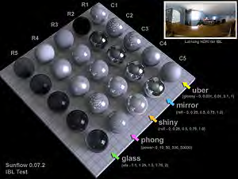

```text
shader {
name sfcon.shader
type constant
color { "sRGB nonlinear" 0.800 0.800 0.800 }
}
```

Various colors showing the constant shader in action.

Aside from being used as a flat shader, the constant shader can also be used to fake lighting when path tracing is

used by increasing the value of the color beyond 1.0.

This is the constant shader with color values above 1.0 with path tracing added to the scene.

It can also be used in conjunction with global illumination to get some interesting results

(http://sunflow.sourceforge.net/phpbb2/viewtopic.php?t=149) .

### Diffuse Shader

```text
shader {
name sfdif.shader
type diffuse
diff { "sRGB nonlinear" 0.800 0.800 0.800 }
}
```

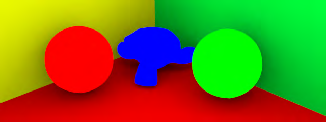

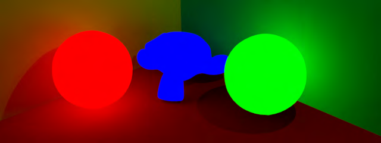

Various diffuse shader colors. The walls are also the diffuse shader.

Textured Diffuse Shader

```text
shader {
name sfdif.shader
type diffuse
```

texture "C:\mypath\image.png"

```text
}
```

### Phong Shader

```text
shader {
name sfpho.shader
type phong
diff { "sRGB nonlinear" 0.800 0.800 0.800 }
spec { "sRGB nonlinear" 1.0 1.0 1.0 } 50
samples 4
}
```

The number after the spec color values is the "power" or hardness of the specularity. You can crank it pretty high

(e.g. 50000), so start with low values like 50 and work you&#39;re way up or down from there. If you set the samples

to 0, you&#39;ll turn off the indirect glossy reflections. If you set the samples to anything greater than 1, you&#39;ll get blurry

reflections (with higher samples giving better reflections).

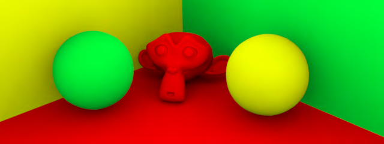

### The sphere on the left has samples set to 0 (so no blurry reflections) whereas two right objects have samples

### >0 (so have blurry reflections).

## Textured Phong Shader

```text
shader {
name sfpho.shader
type phong
```

texture "C:\mypath\image.png"

```text
spec { "sRGB nonlinear" 1.0 1.0 1.0 } 50
samples 4
}
```

## Shiny Shader

```text
shader {
name sfshi.shader
type shiny
diff { "sRGB nonlinear" 0.800 0.800 0.800 }
refl 0.5
}
```

## Remember that you can go beyond 1.0 for the reflection value to really kick it up a notch - bam.

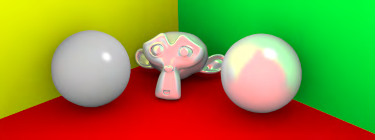

### The sphere on the left has a lower reflection setting than the two objects on the right.

## Textured Shiny Shader

```text
shader {
name sfshi.shader
type shiny
```

texture "C:\mypath\image.png"

```text
refl 0.5
}
```

## Glass Shader

```text
shader {
name sfgla.shader
type glass
eta 1.0
color { "sRGB nonlinear" 0.800 0.800 0.800 }
absorbtion.distance 5.0
absorbtion.color { "sRGB nonlinear" 1.0 1.0 1.0 }
}
```

## The "eta" is more commonly known as "or"i or index of refraction. It&#39;s important to note that without caustics turned

## on, the glass shader will cast shadows like any other object.

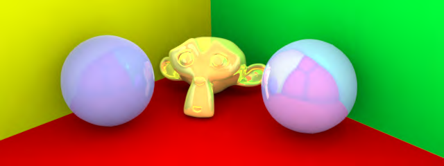

The sphere on the left has an eta of 1.33 (water) and the right two objects have an eta of 1.5 (glass).

Absorption

It&#39;s important to note that for the glass shader, the absorption lines are optional. Kirk did some tests using the

absorption lines which I have added here:

Absorption Distance = Absorption Distance = Absorption Distance =

0.01 0.05 0.1

Absorption Distance = Absorption Distance = Absorption Distance =

0.5 1.0 5.0

And for those savvy readers, I&#39;ll mention that the syntax&#39;s spelling of absorbtion isn&#39;t a typo. This spelling error has

been fixed in the SVN so that Sunflow will recognize this spelling and the correct one.

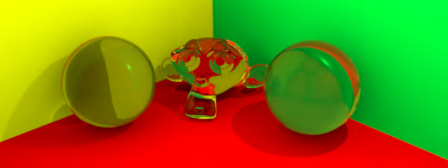

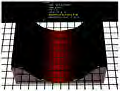

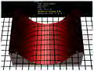

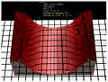

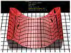

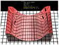

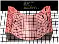

Trace Depths

You can also manipulate the trace depths for glass by adding:

```text
trace-depths {
diff 1
refl 4
refr 4
}
```

If you don&#39;t add this to the scene file, the defaults of diff 1, refl 4, and refr 4 will be used. For glass the two

important ones are refl and refr. For a look at various trace-depths in action see the below tests by Sielan:

Diff=1, Refl=1, Refr=1 Diff=2, Refl=2, Refr=2 Diff=5, Refl=5, Refr=5

Diff=8, Refl=8, Refr=8 Diff=12, Refl=12,

Refr=12

Caustics

To enable caustics for glass you would add this to the scene:

```text
photons {
caustics 1000000 kd 100 0.5
}
```

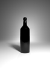

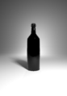

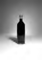

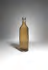


For casutics you set the number of photons you want to use. Currently only kd mapping is allowed. Then you need

to define the estimate and radius (in the example above the estimate is 100 and the radius is 0.5). These values are

used at a single secondary bounced photon (of the many photons used). At that point, sphere with a radius expands

outward to encompass a certain number of other photons (estimate) to be used to determine the caustics at that

point. For estimates, typically 30 to 200 photons are used.

### Mirror Shader

```text
shader {
name sfmir.shader
type mirror
refl { "sRGB nonlinear" 0.800 0.800 0.800 }
}
```

The sphere on the left has a darker color, the right two objects have a pure white color.

### Ward Shader

```text
shader {
name sfwar.shader
type ward
diff { "sRGB nonlinear" .80 1 .80 }
spec { "sRGB nonlinear" 1 1 1 }
rough .07 .1
samples 4
}
```

The x and y rough values are the amount of blurriness in the u and v tangent directions at the surface. The x and y

rough values correspond to u and v tangent directions, so for the ward shader, you&#39;ll need to have uv coordinates

defined on the object to get a proper result. If you set the samples to 0, you&#39;ll turn off the indirect glossy reflections.

If you set the samples to anything greater than 1, you&#39;ll get blurry reflections (with higher samples giving better

reflections).

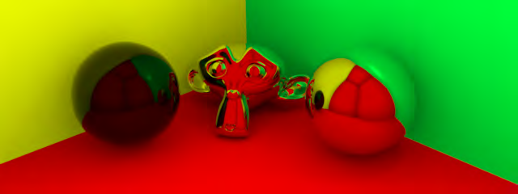

The sphere on the left has the roughness and color different from the right two objects.

Some users of the ward shader are surprised that the result doesn&#39;t look like a similar shader in their other favorite

application. That look having a metallic surface texture. This shader is a true ward shader, whereas other apps may

add other effects to get the metal bump.

Note that the ward shader in 0.07.2 may cause a NaN error (black dots). This bug has been fixed in the the SVN

0.07.3 version.

Textured Ward Shader

```text
shader {
name sfwar.shader
type ward
```

texture "C:\mypath\image.png"

```text
spec { "sRGB nonlinear" 1 1 1 }
rough .07 .1
samples 4
}
```

### Ambient Occlusion Shader

```text
shader {
name sfamb.shader
type amb-occ
bright { "sRGB nonlinear" 0 0 0 }
dark { "sRGB nonlinear" 1 1 1 }
samples 32
dist 3.0
}
```

Ambient occlusion shades based on geometric proximity - it totally ignores lights. The ambient occlusion gi engine

does recognize lights.

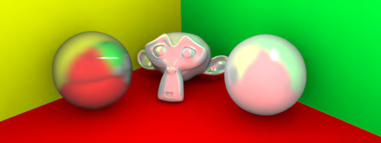

The sphere on the left a different light and dark color, the right two objects have the classic light = white and

dark = black color.

Textured Ambient Occlusion Shader

```text
shader {
name sfamb.shader
type amb-occ
```

texture "C:\mypath\image.png"

```text
dark { "sRGB nonlinear" 1.0 1.0 1.0 }
samples 32
dist 3.0
}
```

The amb-occ textured shader has been tricky for me in that I&#39;ve never had much success with it. Maybe someone

will post to this thread how they&#39;ve used it.

### Uber Shader

The uber shader is a mix of several shaders to give you more options in controlling the look with the added bonus

of being able to use a specular texture map. Though typically used with textures it can be used without both or on of

the textures by removing the texture line(s).

```text
shader {
name sfuber.shader
type uber
diff { "sRGB nonlinear" 0.8 0.8 0.8 }
```

diff.texture "C:\mypath\diffimage.png"

diff.blend 1.0

```text
spec { "sRGB nonlinear" 1 1 1 }
```

spec.texture "C:\mypath\specimage.png"

spec.blend 0.1

```text
glossy .1
samples 4
}
```

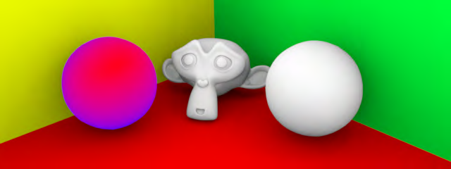

The blend values control the blending between the color and the texture. A blend value of 1 will make the texture

the sole contributor, and a value of 0 will make only the color used. Any value in between will mix the texture and

the color to produce the final result. The glossy setting, which gives you the shiny shader aspect, uses very large

step values to achieve the result. So a value of zero is shiny, and a value of 1 has no glossyness. When playing with

the settings try the following values: 0, 0.001, 0.01, 0.1, and 1. Also, if you don&#39;t need a diffuse or specular texture

(for whatever reason) you can omit the diff.texture and/or spec.texture lines.

In the uber shader, setting the spec color to 0 0 0 and spec.blend to 0 will allow transparency, though this won&#39;t

```text
translate to transparent shadows at the moment.
```

### Command Line Shaders

Wireframe Shader/Normal Shader/UV Shader/ID Shader/Gray Shader/Prims Shader/Quick AO Shader. These

shaders are actually accessed via the command line. I go over how to use these shader flags here.

## Janino Shaders

You might ask the question "What is Janino?" Think of Janino as a Java compiler that only compiles when a janino

```text
shader is encountered. So if you write the shader in Java using Sunflow classes, you can come up with creative
```

shaders without having to edit the source code directly. Some simple testing have shown that the janino shaders

compile just as fast as if they were in the source. The syntax for this shader looks like this:

```text
shader {
name myJaninoShader
type janino
```

<code>

Your code goes here

</code>

```text
}
```

There are several Janino shaders written by forum members:

### Mix Shader

Mark Thorpe wrote this mix shader which blends two shaders you define over an object. It was later found that

```text
running the shader on a multi-threaded machine caused this shader to return odd results which lead to the re-
```

write/re-format by Don Casteel.

### Fresnel Shader

Another mix shader, the fresnel shader uses the blend function in the api to mix two shaders you define based on

the cosine between the shading normal and the ray. What&#39;s really cool is that you can change the blending just by

defining your own value for c.

### Stained Glass

Another elegant janino shader by Mark Thorpe, the stained glass shader gives a stained glass look by applying a

texture to a glass shader. You need caustics turned on in your scene for this to work as intended.

### Shiny Shader with Reflection Mapping

This shader is the shiny shader, except instead of setting a globally induced reflection value, I made it so you can

use a texture to control the reflection value over the object. That way, you can have different reflection values in

different places.

### Simple SSS

Prior to the monumental undertaking that is the True SSS shader, Don tried a simple solution to fake subsurface

scattering.

### Specular Pass

This was a shader that was more of a proof of concept. Someone on the forum asked how we could derive passes

from Sunflow even though Sunflow doesn&#39;t yet have that ability. I suggested you could use a janino shader to pull

```text
out the pass you want and gave this example which is the phong shader with the spec color of white and no diffuse
```

shading.

### Translucent Shader

A cool translucent shader from Mark Thorpe based off Don&#39;s True SSS shader.

### Wire Shader

This shader doesn&#39;t work in 0.07.2 since there have been changes to the source code since it was created. I&#39;ve

included it here for reference. Plus, there is a command line wire frame shader that makes this shader superfluous.

## Source Code Shaders

Shaders so awesome, they needed modifications to the source code to make them happen.

### True SSS

This subsurface scattering shader is currently under development, but it&#39;s still amazing.

### Textured SSS

Don&#39;s work in developing a procedural marble texture and volume shader that compliments his True SSS shader.