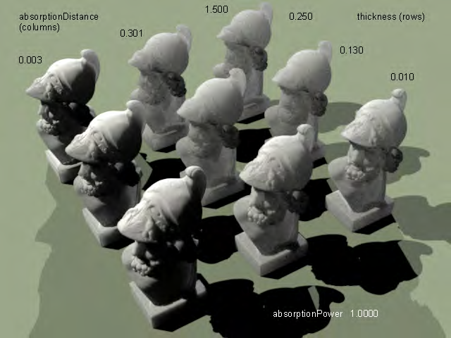

# True SSS

From Sunflow Wiki

Author: Don Casteel

## Contents

1 Source Code Changes

2 .sc Syntax

3 Diff

4 Tests

## Source Code Changes

In order to correctly render the subsurface scattering, a modification was needed in the source code and therefore

needs a special build of Sunflow. The problem was that the surface normals have to be controlled carefully to keep

them from pointing inward from the surface even if the ray being traced is the inside heading out. For this reason,

the shader requires that you use a special build.

## .sc Syntax

Since we need to have a special build, Don also took the time to incorporate the shader into the .sc file format

whose syntax looks like this:

```text
shader {
name "sssShdr"
type sss
diff 0 1 1
//texture "../mypath/image.png"
```

absorptionDistance 0.001

absorptionPower 1

```text
thickness 0.005
```

sssRays 4

```text
specular 0.2 0.2 0.2 80
```

phongRays 6

```text
}
```

## Diff

If you would like to build your own or see the changes that were made to the source, I have the diff from the 0.07.3

SVN build I did:

0.07.3 SVN Java 1.6 diff (http://www.geneome.net/drawer/sunflow/J16-SSS-SVN-sunflow.diff)

0.07.3 SVN Java 1.5 diff (http://www.geneome.net/drawer/sunflow/J15-SSS-SVN-sunflow.diff)

## Tests

Don recently posted this to the thread (http://sunflow.sourceforge.net/phpbb2/viewtopic.php?p=4037#4037) which

I find very helpful: "I&#39;m working on understanding the relationships between the shader parameters and the

appearance. The general size of the model affects what parameters you&#39;ll want to use, as well as the thinest cross

sections. I haven&#39;t checked yet, but assume scaleu will not affect the appearance since rays get the inverse

```text
transform allpied when checking for intersection.
```

The ratio between absorptionDist and thickness seems to make a difference, you can achieve the same level of

translucence with different ratios but starting with a higher thickness will help soften the apparent geometry details,

where lower values preserve them.

I&#39;ve got a lot more playing to do, but thought I&#39;d share this render:

