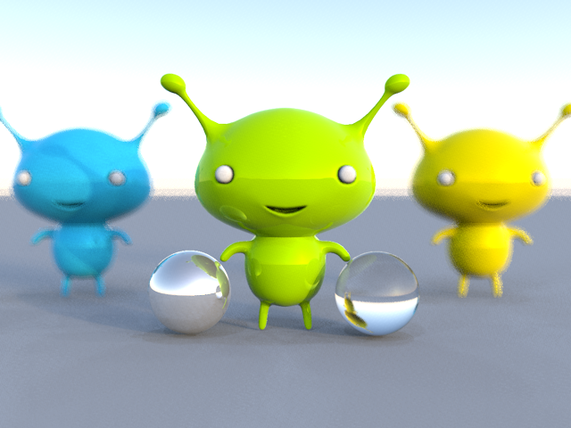
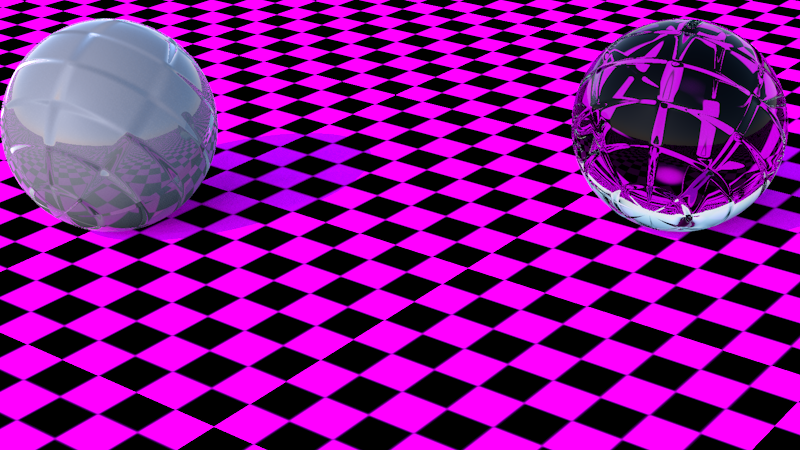
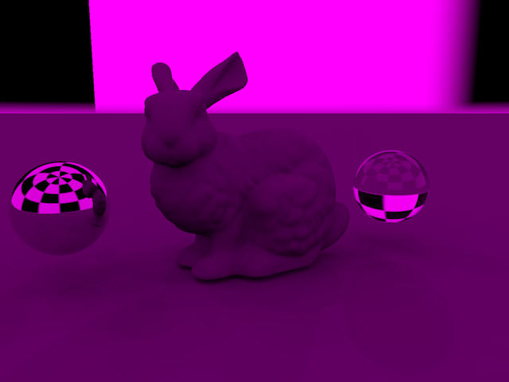
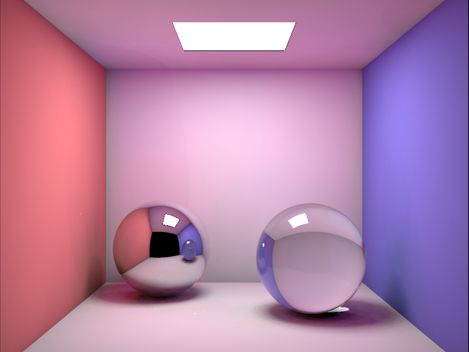
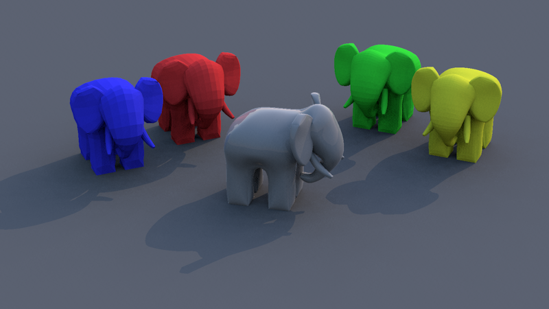
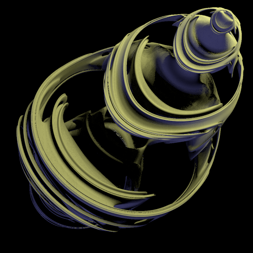

# SunflowSharp Example Scenes

This directory contains a collection of example scene files supported by the SunflowSharp engine. These files are provided in the `.sc.gz` compressed format and can be rendered using the command line.

## 🖼 Examples Gallery

| Preview | Scene File | Description |
| :---: | :--- | :--- |
|  | [aliens_shiny.sc.gz](aliens_shiny.sc.gz) | High-gloss shaders demonstrating multiple reflections and complex geometry. |
|  | [bump_demo.sc.gz](bump_demo.sc.gz) | Showcases bump mapping and normal mapping techniques using various textures. |
|  | [bunny_ibl.sc.gz](bunny_ibl.sc.gz) | The classic Stanford Bunny rendered using Image Based Lighting (IBL) and global illumination. |
|  | [cornell_box_jensen.sc.gz](cornell_box_jensen.sc.gz) | A classic Cornell Box setup for testing Global Illumination (Jensen's method). |
|  | [gumbo_and_teapot.sc.gz](gumbo_and_teapot.sc.gz) | Combined geometry test featuring the Gumbo character and the Utah Teapot. |
|  | [julia.sc.gz](julia.sc.gz) | Procedural 3D Julia fractal geometry demonstrating the engine's mathematical primitive support. |

## 🚀 How to Render

To render any of these examples from the root directory, use the following command pattern:

```bash
dotnet run --project SunflowSharp.Test/SunflowSharp.Test.csproj -- examples/<scene_name>.sc.gz
```

**Example:**
```bash
dotnet run --project SunflowSharp.Test/SunflowSharp.Test.csproj -- examples/julia.sc.gz
```

The resulting image will be saved as `output.png` by default in the current working directory.
